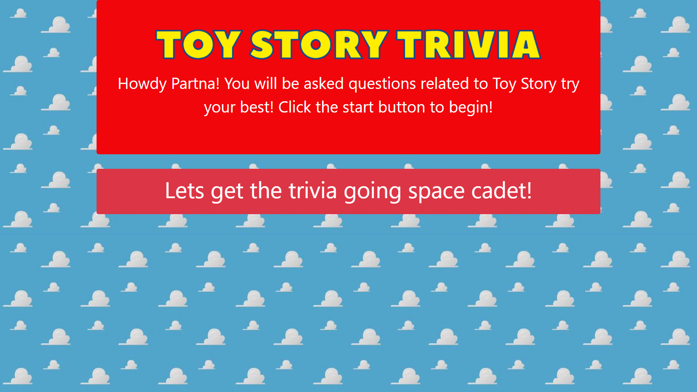

## Link to project
https://jcabs14.github.io/TriviaGame/

<!-- PROJECT LOGO -->
<br />
<p align="center">
  <a>
    
  </a>
</p>

<!-- TABLE OF CONTENTS -->
## Table of Contents

* [About the Project](#about-the-project)
  * [Built With](#built-with)
* [Getting Started](#getting-started)
  * [Prerequisites](#prerequisites)
  * [Installation](#installation)
* [Usage](#usage)
* [Contact](#contact)

<!-- ABOUT THE PROJECT -->
## About The Project




[Link to deployed project](https://jcabs14.github.io/Toy-Story-Trivia/)

### Built With
* [Javascript](https://www.javascript.com/)
* [HTML5](https://html.spec.whatwg.org/multipage/)

<!-- GETTING STARTED -->
## Getting Started

### Prerequisites

Have Visual Studio Code installed or similar application

### Installation

In your favorite terminal do the following:

1. Clone the repo
```sh
git clone https://github.com/Jcabs14/clicky-game
```
2. Starting project locally
Press Alt+B or right click on the index.html file and open in your favorite browser

<!-- USAGE EXAMPLES -->
## Usage

The game is started clicking on the button under the title. The user is then asked a question with 4 answers. The user must click which answer they think is correct. Once a answer is clicked the application will show if the answer is correct or not. Each question will have a time limit of 30 seconds. If the time runs out the answer will automatically be wrong. The end of the questions will display how many answers were correct or incorrect. 

<!-- CONTACT -->
## Contact

Jared Cabanilla

jcabanilla@gmail.com

Project Link: [https://github.com/Jcabs14/clicky-game](https://github.com/Jcabs14/clicky-game)


